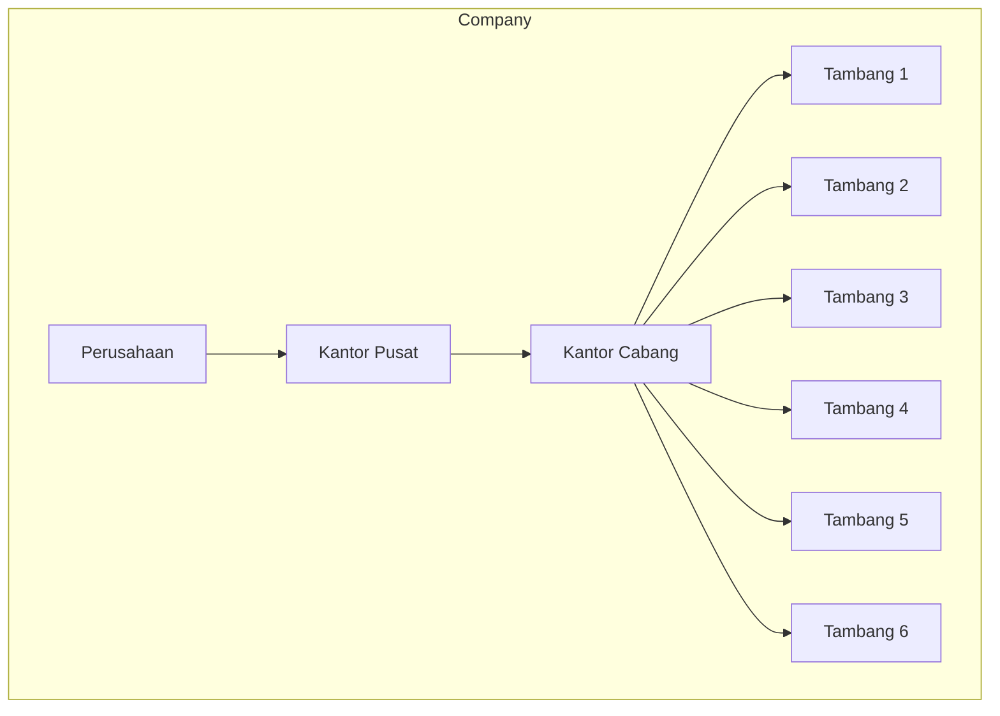
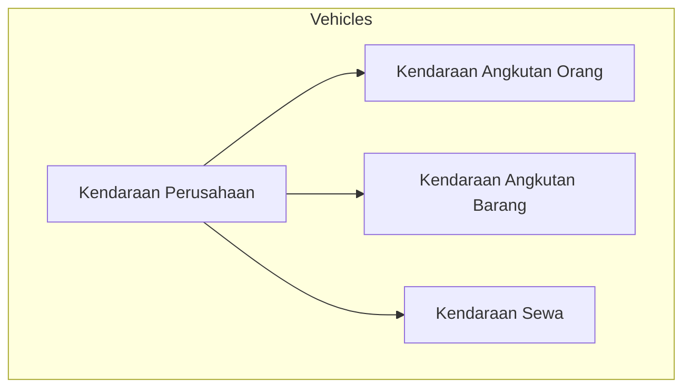
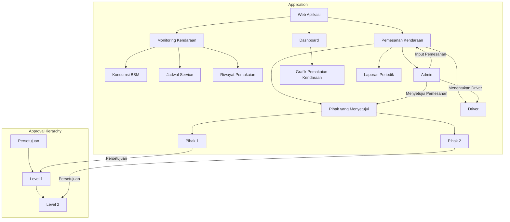
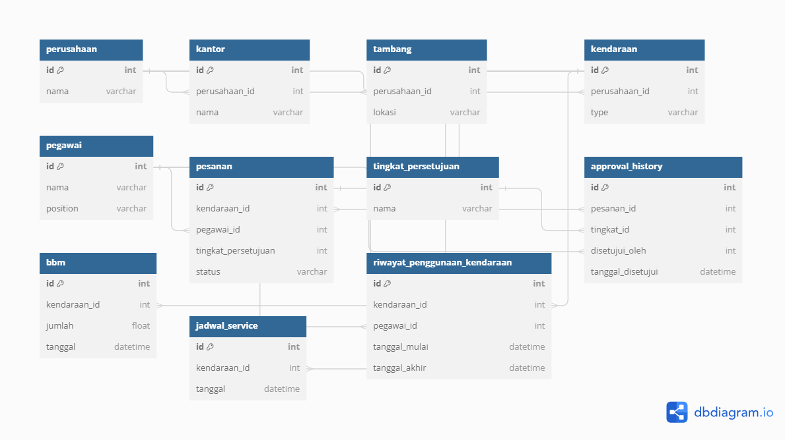

# Sistem Monitoring Kendaraan Proyek
## Arsitektur Aplikasi Pemesanan Kendaraan

```mermaid
graph TD;
  subgraph Company
    f1[Perusahaan]
    f1 --> f2[Kantor Pusat]
    f2 --> f3[Kantor Cabang]
    f3 --> f4[Tambang 1]
    f3 --> f5[Tambang 2]
    f3 --> f6[Tambang 3]
    f3 --> f7[Tambang 4]
    f3 --> f8[Tambang 5]
    f3 --> f9[Tambang 6]
  end 
```

```mermaid
graph TD;
    subgraph Vehicles
    f10[Kendaraan Perusahaan]
    f10 --> f11[Kendaraan Angkutan Orang]
    f10 --> f12[Kendaraan Angkutan Barang]
    f10 --> f13[Kendaraan Sewa]
  end
```

```mermaid
graph TD;
    subgraph Application
    f14[Web Aplikasi]
    f14 --> f15[Monitoring Kendaraan]
    f15 --> f16[Konsumsi BBM]
    f15 --> f17[Jadwal Service]
    f15 --> f18[Riwayat Pemakaian]
    f14 --> f19[Pemesanan Kendaraan]
    f19 --> f20[Admin]
    f19 --> f21[Pihak yang Menyetujui]
    f21 --> f22[Pihak 1]
    f21 --> f23[Pihak 2]
    f19 --> f24[Driver]
    f14 --> f25[Dashboard]
    f25 --> f26[Grafik Pemakaian Kendaraan]
    f19 --> f27[Laporan Periodik]
  end

  subgraph ApprovalHierarchy
    f29[Persetujuan]
    f29 --> f30[Level 1]
    f30 --> f31[Level 2]
  end

  f20 -->|Input Pemesanan| f19
  f20 -->|Menentukan Driver| f24
  f20 -->|Menyetujui Pemesanan| f21
  f22 -->|Persetujuan| f30
  f23 -->|Persetujuan| f31
```
## Design Database

