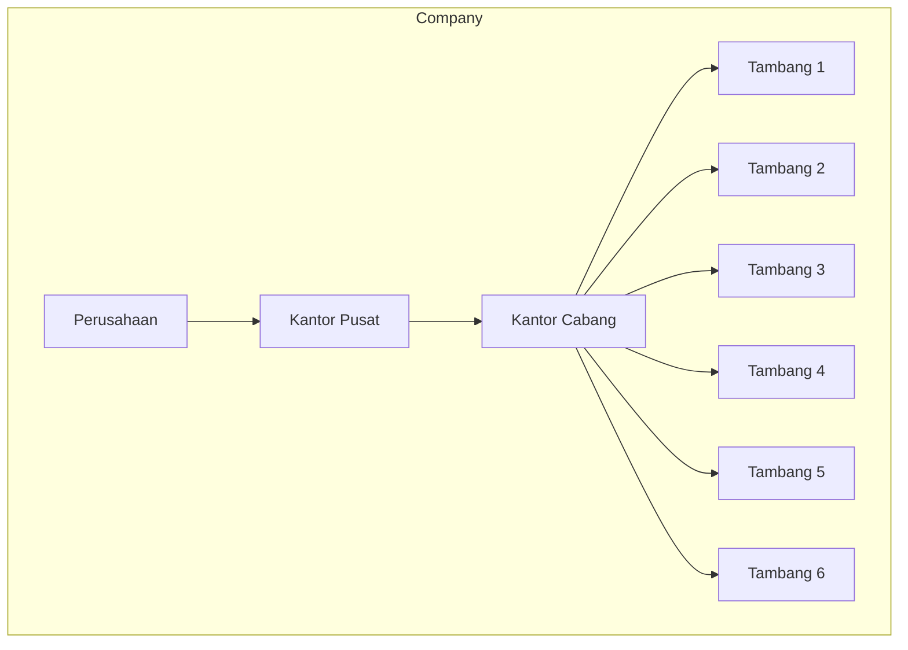
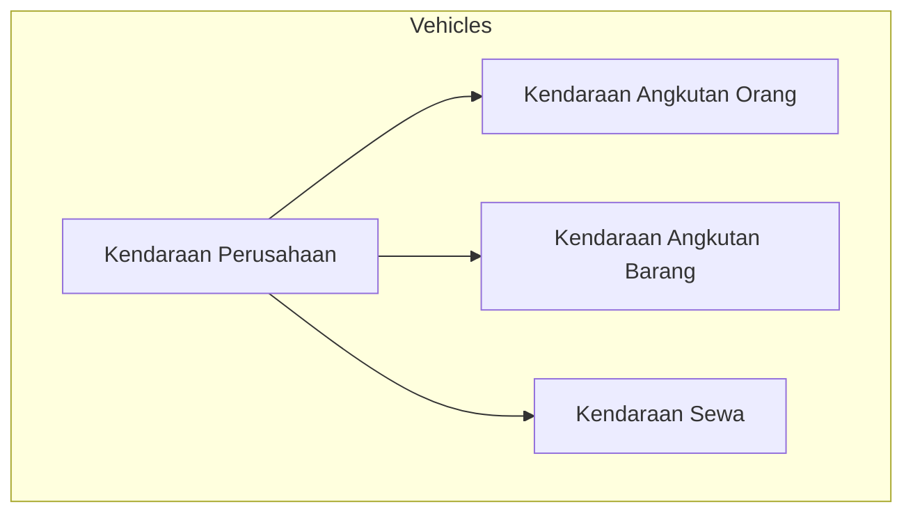
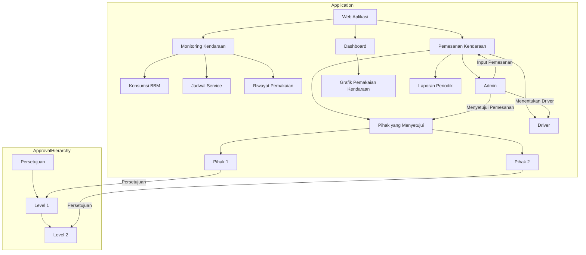

# Sistem Pemesanan Kendaraan - Dokumentasi

## Deskripsi Proyek

Sistem ini dirancang untuk memfasilitasi pemesanan, pemantauan, dan manajemen kendaraan pada perusahaan tambang nikel. Dengan aplikasi ini, admin dapat mengelola pemesanan kendaraan, manajemen armada, dan data karyawan.

## Fitur Utama

- **Manajemen Pemesanan:**
  - Input pemesanan kendaraan oleh admin.
  - Persetujuan pemesanan oleh pihak yang ditentukan yaitu pihak satu dan pihak 2.
  - Monitoring status pemesanan.

- **Manajemen Kendaraan:**
  - Pendaftaran, pemeliharaan, dan penghapusan kendaraan.
  - Informasi lengkap mengenai setiap kendaraan.

- **Manajemen Karyawan:**
  - Pendaftaran dan pemeliharaan data karyawan.

- **Laporan dan Analisis:**
  - Laporan pemesanan kendaraan.
  - Statistik konsumsi BBM dan layanan kendaraan.

## Arsitektur Aplikasi Pemesanan Kendaraan



## Environment 
- Database: MySQL
- PHP Version: 8.2
- Framework: Laravel
## Panduan Penggunaan Aplikasi
### Instalasi
1. Clone Repositori:
```
git clone https://github.com/nama-username/sistem-pemesanan-kendaraan.git
```
2. Pindah ke Direktori Proyek:
```
cd sistem-pemesanan-kendaraan
```
3. Instal Dependency:
```
composer install
```
4. Salin Berkas .env:
```
cp .env.example .env
```
### Konfigurasi .env:

1. Buka file .env dan sesuaikan konfigurasi database:
```
DB_CONNECTION=mysql
DB_HOST=127.0.0.1
DB_PORT=3306
DB_DATABASE=nama_database
DB_USERNAME=db_monitoring_kendaraan
DB_PASSWORD=kata_sandi_database
```
2. Key Aplikasi:
```
php artisan key:generate
```
3. Jalankan Migrasi dan Seeder:
```
php artisan migrate --seed
```
4. Jalankan Aplikasi:
```
php artisan serve
```
Buka Aplikasi:
Akses aplikasi melalui ```http://localhost:8000``` pada browser Anda.
### Daftar Pengguna
- Admin
  - email: admin@gmail.com
  - password: 12341234
- Kepala Divisi (Level 2)
  - email: divisi@gmail.com
  - password: 12341234
- Kepala Pusat (Level 1)
  - email: pusat@gmail.com
  - password: 12341234
